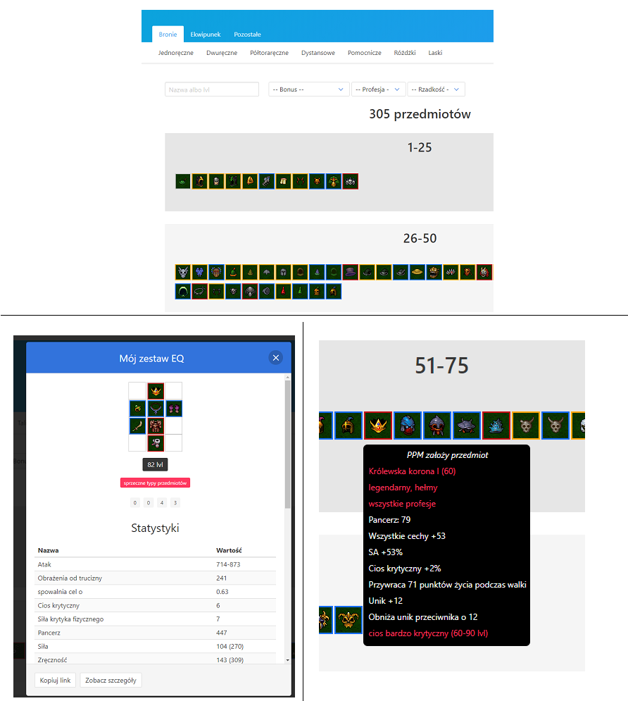

# About
[Margonem](https://margonem.com/) is a browser-based MMORPG. In early 2018 I decided to create an inventory helper for this game - https://margo.eryk.io

# Tech stack
* [Vue.js](https://vuejs.org/)
* [Django REST Framework](https://www.django-rest-framework.org/)
* [Vuex](https://vuex.vuejs.org/) (state management for Vue)
* [Bulma CSS](https://bulma.io/)
* Docker & Docker Compose

# Features
* adding new items to the database from the game using web scraping scripts
* search & compare items
* browse a list of items split into different categories
* right click the item to add it to your virtual equipment
* build the entire equipment and see its summary
* generate URL for your virtual equipment so you can share it with others

# Preview

